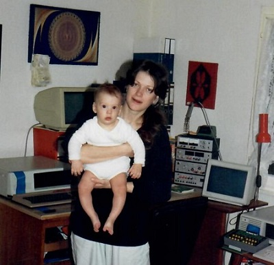
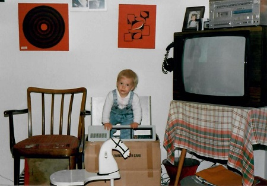
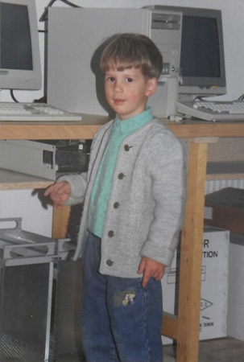

# Hey❗This is 0x007e also called tilde 🙃

## About me:
* 👨‍💻 Electronics/Software engineer and problem solver
* 🌍 I´m from planet earth, milky way, universe nr. 1337 
* 🏫 Teaching/Supervisioning/Coaching of young talents
* 💻 Working with computers since the late 1980´s
* 💗 Love designing things from scratch
* 🔮 Inspired by technology

## Interested in:

Everything with a transistor 😀 that can be programmed, opensource, electronics, programming, wireless communication (📶HAM-Radio), ⛰ nature and 🧗sports

## Worked with:
### Programming languages:
  
  
  
  
  
  
  
  
  
  
  
  
  

  
  
  basic-0000a5?style=for-the-badge&logo=qbasic&logoColor=ffdd54)

### Text things:
  
  
  
  
  
  

### Scripting

  
  
  

### Databases
  
  
  
  
  
  
  

### Frameworks
  
  
  
  
  
  
  
  
  
  
  
  
  
  
  
  
  
  

### Other
  
  
  
  
  
  
  
  
  
  
  
  
  
  
  
  
  
  
  
  

### Platforms:
  
  
  
  
  
  
  
  

### Operating Systems:
  
  
  
  
  
  
  

  
  
  
  
  
  

  
  
  

### Networking
  
  
  
  

### Electronic/Mechanical Design:
  
  
  
  
  

## Stats
  

  

---
🧮 Me and my mum, behind you see my workplace in the late 80´s 💾! Ok maybe it´s the workplace of my dad and i just used it sometimes.

Me, checking if there is enough space in the computer case!

Instructing the photographer.

---

🤙🖖 G.Raf
